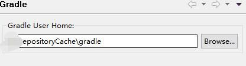

title: Eclipse中Gradle插件的使用
comments: true
---
### 安装

　　无论你使用的是 eclipse/sts/myeclipse 还是任何eclipse的变种,可以通过点击`Help->eclipse marketplace`去插件市场搜索buildship然后点击`install`进行安装,此过程完全傻瓜操作,不赘述.   
    

如果你是一名传统程序猿习惯通过site安装,可以参考下面的表格通过点击`Help->Install New Software`进行手动安装

Eclipse Version | Type      | Update Site
--------------  | ----------| ------------
Neon (4.6)      | release   | `http://download.eclipse.org/buildship/updates/e46/releases/1.0`
                | milestone | `http://download.eclipse.org/buildship/updates/e46/milestones/1.0`
                | snapshot  | `http://download.eclipse.org/buildship/updates/e46/snapshots/1.0`
Mars (4.5)      | release   | `http://download.eclipse.org/buildship/updates/e45/releases/1.0`
                | milestone | `http://download.eclipse.org/buildship/updates/e45/milestones/1.0`
                | snapshot  | `http://download.eclipse.org/buildship/updates/e45/snapshots/1.0`
...
更早版本可以参考上面两条自己修改地址 具体方式只需要把你所需的eclipse版本中间的小数点去掉即可 修改e45/e46参数.
                
### 配置   
　　安装完毕后,点击`Window->perferences->gradle`进行一些配置操作,其实就一个配置 就是配置下本地缓存目录
      
### 导入   
　　
  选择Gradle项目进行导入

    
　　选择需要进行导入项目的根目录   

　　
  进行一些适当的配置，描述比较简单，这里不做翻译，一般情况下选择本地安装的gradle版本即可   

  
  经过一段时间的等待（验证脚本、下载依赖）后，导入即可完成。

                    
### 创建   
　　按照常规方式创建项目,创建时选择gradle project即可,创建向导与导入向导如出一辙,不再赘述

### 转入
　　如果想为项目添加Gradle支持,请在需要添加的项目上右键->Gradle->Add gradle nature即可
  

### 配置
 导入成功后找到gradle窗格，可见`Gradle task`和`Gradle exec`两个页签,其中`task`页签列出了所有的可执行的任务,`exec页签`则会在执行任务后展示执行日志
 
 
 
 
 当然控制台也会打印执行的详细信息
 
 
### 补充
  插件自带的编辑器是没有语法着色的,可以安装下面这个,可以对关键字进行高亮展示.当然,语法提示的话,肯定是没有的
 